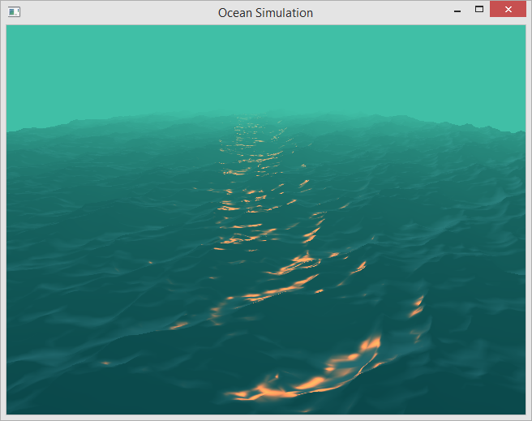

## Introduction

Ocean simulation is based on the project by [Keith Lantz](https://keithlantz.net/).
This program is a downport to older OpenGL 2.0 as well as GLSL 1.10 and GLSL 1.30,
since the original is using modern GLSL >4.00. The model can be run on very old GPUs.
For example, it is possible to run this model even on Mobile Intel 965 ;)

The numerical model is based on the paper by J. Tessendorf and utilizes
Phillips spectrum and algorithm of inverse FFT.



## Prerequisites

Compiling and running the sample project requires GCC, CMake, GNU Make
as well as FreeType library for text rendering. Most of the dependencies needed
are bundled with the repository. This includes:

* [glad](https://github.com/Dav1dde/glad) - OpenGL Function Loader.
* [glfw](https://github.com/glfw/glfw) - Windowing and Input.
* [glm](https://github.com/g-truc/glm) - OpenGL Mathematics.
* [plog](https://github.com/SergiusTheBest/plog) - Logging library.

## Environment Setup

### Debian-based Systems

The following instructions apply to:

* Ubuntu 16.04
* Debian 9

```
apt-get install \
    build-essential \
    cmake \
    xorg-dev \
    libgl1-mesa-dev \
    libfreetype6-dev
```

### RedHat-based Systems

The following instructions apply to:

* Fedora 22 and higher

```
dnf install \
    cmake \
    gcc-c++ \
    mesa-libGL-devel \
    libXrandr-devel \
    libXinerama-devel \
    libXcursor-devel \
    libXi-devel \
    freetype-devel
```

* CentOS 7

```
yum install \
    cmake \
    gcc-c++ \
    mesa-libGL-devel \
    libXrandr-devel \
    libXinerama-devel \
    libXcursor-devel \
    libXi-devel \
    freetype-devel
```

## Cloning Repository

Cloning the repository requires passing the `--recursive` flag to load dependencies

```
git clone --recursive https://github.com/Postrediori/OceanSimulation.git
cd OceanSimulation
```

## Building Project

The program is built with the commands below. CMake requires the directory 
with the main project's `CMakeLists.txt` file as an argument. Then the CMake 
creates the build files for the GNU make which build an executable.

```
mkdir build && cd build
cmake ..
make
```

## Building Project in Release Mode

```
mkdir build && cd build
cmake .. -DCMAKE_BUILD_TYPE=Release
make
```

## Running Project

After the successful build the binary `Ocean` will end up in `build/src/Ocean/` directory.

```
cd build/src/Ocean
./Ocean
```

## Installation

In order to make the stand-alone bundle for the simulation executable and all the data files `make install`
is used.

```
cd <PathToProject>/build
make install
```

This will install all of the files required for an executable to `<PathToProject>/bundle/Ocean` directory.

```
cd <PathToProject>/bundle
tree
.
└── Ocean
    ├── data
    │   ├── font.ttf
    │   ├── ocean110.frag
    │   ├── ocean110.vert
    │   ├── ocean130.frag
    │   ├── ocean130.vert
    │   └── ocean.cfg
    └── Ocean

2 directories, 7 files
cd Ocean
./Ocean
```

## Configuration

The parameters of the model can be adjusted in the `data/ocean.cfg` file:

```
# configuration file for Ocean Simulation

# wave parameters
waveAmplitude = 2e-5

# wind parameters
windDirX = 0.0
windDirZ = 12.8

oceanSize = 64
oceanLen = 320.0
oceanRepeat = 5
```

The following parameters are to be adjusted:
* `waveAmplitude` - amplitude of the surface disturbance.
* `windDirX`, `windDirZ` - components of the wind vector. The vertical (Y) component is ignored in the model.
* `oceanLen` - discretization parameter.
* `oceanRepeat` - this model does use only a small patch of memory to model the whole Ocean.
This parameter adjusts the size of the model in terms of one minimal patch. The value represents
the number of ocean patches along X and Z dimensions. E.g. value 5 mean the simulated area will be 5x5
the size of the initial patch.
* `oceanSize`, `oceanLen` - these are the parameters of the initial patch that will be used for
simulation of the ocean. The first parameter is the grid size and the second value
stands for the length of the patch.

## Controls

* `F1` - Toggle fullscreen mode.
* `F2` - Show/hide help on the screen.
* `Mouse` - Control the view.
* `Arrow keys` - Navigate the model.
* `PgUp/PgDown` - Adjust vertical position of the viewer point.
* `1` - Toggle wireframe mode.
* `2` - Toggle solid surface ("normal") mode.

## Links

*  Tessendorf, Jerry. [Simulating Ocean Water](http://citeseerx.ist.psu.edu/viewdoc/download?doi=10.1.1.161.9102&rep=rep1&type=pdf). In SIGGRAPH 2002 Course Notes #9 (Simulating Nature: Realistic and Interactive Techniques), ACM Press.
* [Ocean simulation part one: using the discrete Fourier transform](https://www.keithlantz.net/2011/10/ocean-simulation-part-one-using-the-discrete-fourier-transform/)
* [Ocean simulation part two: using the fast Fourier transform](https://www.keithlantz.net/2011/11/ocean-simulation-part-two-using-the-fast-fourier-transform/)

## TODO
* Add the detection of the latest supported GLSL version as well as shaders adjusted for newer versions.
* Add build instructions for Windows.
