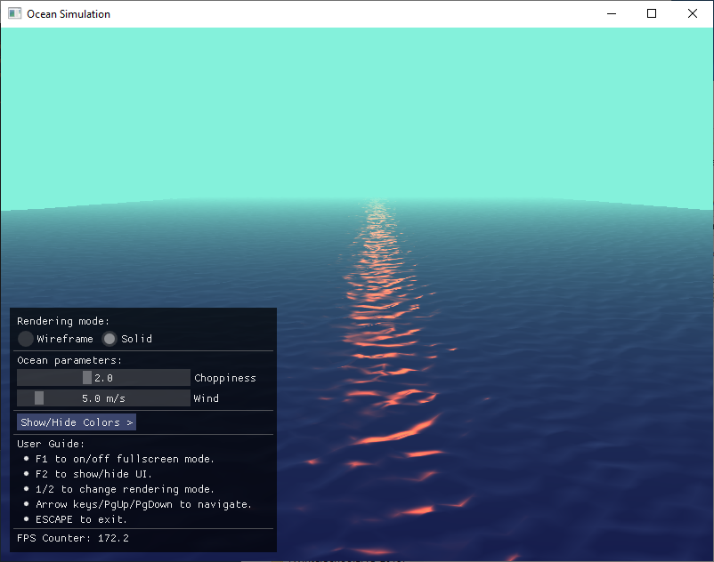
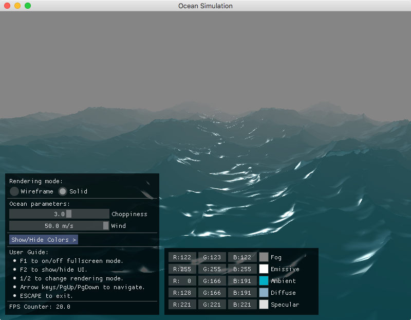

## Introduction

Ocean simulation is based on the project by [Keith Lantz](https://keithlantz.net/).
This program uses OpenGL 3.3 for rendering.
The version that uses OpenGL 2.0 and can be run on older hardware can be checked in a separate branch: [OceanSimulation/opengl2_0]( https://github.com/Postrediori/OceanSimulation/tree/opengl2_0).

The numerical model is based on the paper by J. Tessendorf and utilizes
Phillips spectrum and algorithm of inverse FFT.







## Prerequisites

Compiling and running the sample project requires GCC, CMake, GNU Make.
Most of the dependencies needed for build are bundled with the repository as submodules.
This includes:

* [glad](https://github.com/Dav1dde/glad) - OpenGL Function Loader.
* [glfw](https://github.com/glfw/glfw) - Windowing and Input.
* [glm](https://github.com/g-truc/glm) - OpenGL Mathematics.
* [plog](https://github.com/SergiusTheBest/plog) - Logging library.
* [imgui](https://github.com/ocornut/imgui) - UI library.

## Building for Linux

### Dependencies

The following instructions apply to:

* Ubuntu 20.04, 18.04, 16.04
* Debian 9 and higher

```
sudo apt-get install -y \
    build-essential \
    cmake \
    xorg-dev \
    libgl1-mesa-dev \
    libfreetype6-dev
```

The following instructions apply to:

* Fedora 22 and higher

```
sudo dnf install -y \
    gcc gcc-c++ make \
    cmake \
    mesa-libGL-devel \
    libXrandr-devel \
    libXinerama-devel \
    libXcursor-devel \
    libXi-devel \
    freetype-devel
```

* CentOS 7 and higher

```
sudo yum install -y \
    gcc gcc-c++ make \
    cmake \
    mesa-libGL-devel \
    libXrandr-devel \
    libXinerama-devel \
    libXcursor-devel \
    libXi-devel \
    freetype-devel
```

### Cloning Repository
```
git clone --recursive https://github.com/Postrediori/OceanSimulation.git
cd OceanSimulation
```

Cloning the repository requires passing the `--recursive` flag to load Git submodules.

### Building Project

The program is built with the commands below. CMake requires the directory 
with the main project's `CMakeLists.txt` file as an argument. Then the CMake 
creates the build files for the GNU make which build an executable.

```
mkdir build && cd build
cmake .. -DCMAKE_BUILD_TYPE=Release
make
make install
```

## Running Project

After the successful build the binary `Ocean` will end up in `<source dir>/bundle/Ocean`.

```
cd bundle/Ocean
./Ocean
```

This will install all of the files required for an executable to `<PathToProject>/bundle/Ocean` directory.

```
cd <PathToProject>/bundle
tree
.
└── Ocean
    ├── data
    │   ├── ocean.frag
    │   ├── ocean.vert
    │   └── ocean.cfg
    └── Ocean

2 directories, 7 files
```

## Building for macOS

### Dependencies
You’ll need to download and install the following to build the project:
* Xcode and the Xcode command line tools
* [CMake](https://cmake.org/) (e.g. via homebrew `brew install cmake`)

### Cloning Repository
```
git clone --recursive https://github.com/Postrediori/OceanSimulation
cd OceanSimulation
```

### Using CMake
Generate makefiles for the build:

```
mkdir build
cd build
cmake .. -DCMAKE_OSX_ARCHITECTURES=x86_64 -DCMAKE_BUILD_TYPE=Release
```

### Building
```
make -j4
make install
```

An `Ocean` application bundle will now be present under `<Source directory>/bundle/Ocean`.


## Configuration

The parameters of the model can be adjusted in the `data/ocean.cfg` file:

```
# configuration file for Ocean Simulation

# wave parameters
waveAmplitude = 2e-5

# wind parameters
windDirX = 0.0
windDirZ = 12.8

oceanSize = 64
oceanLen = 320.0
oceanRepeat = 5
```

The following parameters are to be adjusted:
* `waveAmplitude` - amplitude of the surface disturbance.
* `windDirX`, `windDirZ` - components of the wind vector. The vertical (Y) component is ignored in the model.
* `oceanLen` - discretization parameter.
* `oceanRepeat` - this model does use only a small patch of memory to model the whole Ocean.
This parameter adjusts the size of the model in terms of one minimal patch. The value represents
the number of ocean patches along X and Z dimensions. E.g. value 5 mean the simulated area will be 5x5
the size of the initial patch.
* `oceanSize`, `oceanLen` - these are the parameters of the initial patch that will be used for
simulation of the ocean. The first parameter is the grid size and the second value
stands for the length of the patch.

## Controls

* `F1` - Toggle fullscreen mode.
* `F2` - Show/hide UI on the screen.
* `Arrow keys` - Navigate the model.
* `PgUp/PgDown` - Adjust vertical position of the viewer point.
* `1` - Toggle wireframe mode.
* `2` - Toggle solid surface ("normal") mode.

## Links

*  Tessendorf, Jerry. [Simulating Ocean Water](http://citeseerx.ist.psu.edu/viewdoc/download?doi=10.1.1.161.9102&rep=rep1&type=pdf). In SIGGRAPH 2002 Course Notes #9 (Simulating Nature: Realistic and Interactive Techniques), ACM Press.
* [Ocean simulation part one: using the discrete Fourier transform](https://www.keithlantz.net/2011/10/ocean-simulation-part-one-using-the-discrete-fourier-transform/)
* [Ocean simulation part two: using the fast Fourier transform](https://www.keithlantz.net/2011/11/ocean-simulation-part-two-using-the-fast-fourier-transform/)

## TODO
* [x] Adjust ocean parameters in the UI.
* [x] Color adjustment.
* [  ] Mouse navigation.
* [  ] Add build instructions for Windows.
* [  ] Add Vulkan renderer.
